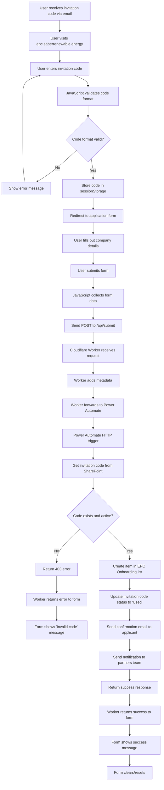

# EPC Portal User Journey & System Flow

## User Journey Flow Diagram



## Detailed Component Flow

### 1. Frontend (epc.saberrenewable.energy)
```
User Input → HTML Form → JavaScript Validation → API Call
```

### 2. API Layer (Cloudflare Worker)
```
Receive Request → Add Metadata → Forward to Power Automate → Handle Response
```

### 3. Backend (Power Automate + SharePoint)
```
HTTP Trigger → Validate Code → Create Record → Update Status → Send Emails → Return Response
```

## System Architecture

```
┌─────────────────────────────────────────────────────────────┐
│                     USER BROWSER                             │
│  ┌─────────────────────────────────────────────────────┐    │
│  │     https://epc.saberrenewable.energy               │    │
│  │  ┌─────────────┐        ┌──────────────────┐       │    │
│  │  │ verify.html │───────>│ application.html │       │    │
│  │  └─────────────┘        └──────────────────┘       │    │
│  └─────────────────────────────────────────────────────┘    │
└──────────────────────────┬──────────────────────────────────┘
                           │ POST /api/submit
                           ▼
┌─────────────────────────────────────────────────────────────┐
│                  CLOUDFLARE WORKER                           │
│  ┌─────────────────────────────────────────────────────┐    │
│  │     epc-portal-api @ epc.saberrenewable.energy/api  │    │
│  │  • CORS handling                                     │    │
│  │  • Request validation                                │    │
│  │  • Metadata injection                                │    │
│  │  • Error handling                                    │    │
│  └─────────────────────────────────────────────────────┘    │
└──────────────────────────┬──────────────────────────────────┘
                           │ POST to webhook
                           ▼
┌─────────────────────────────────────────────────────────────┐
│                    POWER AUTOMATE                            │
│  ┌─────────────────────────────────────────────────────┐    │
│  │     Flow: EPC Portal Submission Handler              │    │
│  │  1. HTTP Trigger (receives JSON)                     │    │
│  │  2. Get Invitation Code from SharePoint              │    │
│  │  3. Validate code is active                          │    │
│  │  4. Create Onboarding record                         │    │
│  │  5. Update invitation status                         │    │
│  │  6. Send confirmation email                          │    │
│  │  7. Send team notification                           │    │
│  │  8. Return response                                  │    │
│  └─────────────────────────────────────────────────────┘    │
└──────────────────────────┬──────────────────────────────────┘
                           │ Read/Write
                           ▼
┌─────────────────────────────────────────────────────────────┐
│                  SHAREPOINT LISTS                            │
│  ┌─────────────────────────────────────────────────────┐    │
│  │  EPC Invitations List                                │    │
│  │  • Title (invitation code)                           │    │
│  │  • Status (Active/Used/Expired)                      │    │
│  │  • UsedDate                                          │    │
│  └─────────────────────────────────────────────────────┘    │
│  ┌─────────────────────────────────────────────────────┐    │
│  │  EPC Onboarding List                                 │    │
│  │  • Company details                                   │    │
│  │  • Contact information                               │    │
│  │  • Business information                              │    │
│  │  • Status (New/InReview/Approved/Rejected)           │    │
│  └─────────────────────────────────────────────────────┘    │
└─────────────────────────────────────────────────────────────┘
```

## Data Flow

### Request Flow (Form → SharePoint)
```json
{
  "invitationCode": "ABCD1234",
  "companyName": "Solar Solutions Inc",
  "registrationNumber": "REG123456",
  "contactName": "John Doe",
  "contactTitle": "CEO",
  "email": "john@solarsolutions.com",
  "phone": "555-0123",
  "address": "123 Solar St, CA",
  "services": ["Installation", "Maintenance"],
  "yearsExperience": 5,
  "teamSize": 25,
  "coverage": "California",
  "certifications": "NABCEP",
  "timestamp": "2024-11-08T10:30:00Z",
  "source": "epc.saberrenewable.energy"
}
```

### Response Flow (SharePoint → Form)

#### Success Response:
```json
{
  "success": true,
  "message": "Application submitted successfully",
  "referenceNumber": "12345"
}
```

#### Error Response:
```json
{
  "success": false,
  "message": "Invalid or expired invitation code"
}
```

## Security & Validation Points

1. **Frontend Validation**
   - Code format check (alphanumeric, 8 chars)
   - Required fields validation
   - Email format validation
   - Session-based access control

2. **API Layer Security**
   - CORS restricted to epc.saberrenewable.energy
   - Request method validation (POST only)
   - Error handling without exposing internals

3. **Backend Validation**
   - Invitation code exists in SharePoint
   - Invitation code is Active (not Used/Expired)
   - Duplicate submission prevention (code marked as Used)

4. **Data Integrity**
   - Timestamp injection for audit trail
   - Source tracking for analytics
   - Status workflow (Active → Used)

## URLs & Endpoints

- **Public Form**: https://epc.saberrenewable.energy
- **API Endpoint**: https://epc.saberrenewable.energy/api/submit
- **Power Automate Webhook**: Internal URL (authenticated)
- **SharePoint Site**: https://saberrenewables.sharepoint.com/sites/SaberEPCPartners
- **GitHub Repo**: https://github.com/MarStackai/saber-epc-portal

## Deployment Pipeline

```
GitHub Push → Cloudflare Pages Build → Auto Deploy → Live Site
```

## Testing Checklist

- [ ] Valid invitation code allows access
- [ ] Invalid code shows error message
- [ ] Form submission creates SharePoint record
- [ ] Invitation code marked as Used after submission
- [ ] Confirmation email sent to applicant
- [ ] Notification email sent to team
- [ ] Success message displayed to user
- [ ] Form resets after submission
- [ ] CORS works correctly
- [ ] Error handling for network issues